# Notion Journal - Preserve Original Creation Dates

A Python script that copies the "Created Time" from Notion journal pages to a custom "Publication Date" text field, helping you preserve the original creation dates of your journal entries.

## 🎯 What It Does

- Fetches all pages from your Notion journal database
- Copies each page's "Created Time" to the "Publication Date" field
- Handles pagination automatically (processes all pages, not just the first 100)
- Shows progress as it updates each page

## 📊 How It Works - Visual Flow

```mermaid
flowchart TD
    Start([Start Program]) --> CheckAPI{API Key<br/>Set?}
    CheckAPI -->|No| Error1[❌ Exit: API Key Required]
    CheckAPI -->|Yes| Init[Initialize Notion Client]
    
    Init --> Query[Query Data Source]
    Query --> Fetch[Fetch 100 Pages]
    Fetch --> AddPages[Add to Pages List]
    
    AddPages --> CheckMore{More Pages<br/>Available?}
    CheckMore -->|Yes| UpdateCursor[Update Cursor]
    UpdateCursor --> Fetch
    CheckMore -->|No| Summary[📊 Show Total Count]
    
    Summary --> CheckEmpty{Pages<br/>Found?}
    CheckEmpty -->|No| Error2[⚠️ Exit: No Pages]
    CheckEmpty -->|Yes| StartUpdate[Begin Updates]
    
    StartUpdate --> Loop{For Each<br/>Page}
    Loop --> GetTime[Get Created Time]
    GetTime --> Update[Update Publication Date]
    
    Update --> Success{Update<br/>Success?}
    Success -->|Yes| Count1[✅ Success Count++]
    Success -->|No| Count2[❌ Log Error]
    
    Count1 --> Progress[Show Progress]
    Count2 --> Progress
    Progress --> Loop
    
    Loop -->|All Done| Final[📊 Show Final Stats]
    Final --> End([✅ Complete])
    
    Error1 --> End
    Error2 --> End
    
    style Start fill:#90EE90
    style End fill:#90EE90
    style Error1 fill:#FFB6C6
    style Error2 fill:#FFB6C6
    style Final fill:#87CEEB
    style Summary fill:#87CEEB
```



## 🔄 Program Execution Sequence


## 📈 Timeline Example


## 📋 Prerequisites

- Python 3.12+
- A Notion integration token
- A Notion database with a "Publication Date" text field

## 🚀 Quick Start

### 1. Clone the Repository

```bash
git clone https://github.com/asamountain/NotionPreservingOriginalDatesJournalDB.git
cd NotionPreservingOriginalDatesJournalDB
```

### 2. Set Up Virtual Environment

```bash
python3.12 -m venv venv
source venv/bin/activate
pip install -r requirements.txt
```

### 3. Get Your Notion API Key

1. Go to [Notion Integrations](https://www.notion.so/my-integrations)
2. Click "+ New integration"
3. Give it a name (e.g., "Journal Date Copier")
4. Copy the "Internal Integration Token"

### 4. Share Your Database with the Integration

1. Open your Notion database
2. Click the "..." menu in the top right
3. Select "Connect to" and choose your integration

### 5. Configure the Script

Open `copy_created_dates.py` and update the `DATA_SOURCE_ID` on line 14:

```python
DATA_SOURCE_ID = "your-data-source-id-here"
```

To find your data source ID, you can use the Notion API or run a search to discover it from your database.

### 6. Run the Script

```bash
export NOTION_API_KEY="your_notion_api_key_here"
./run.sh
```

Or run directly:

```bash
export NOTION_API_KEY="your_notion_api_key_here"
./venv/bin/python copy_created_dates.py
```

## 📝 Output Example

```
📄 Querying data source directly (fast method)...
============================================================
   Fetched 100 pages... (total: 100)
   Fetched 100 pages... (total: 200)
   Fetched 50 pages... (total: 250)
✅ Found 250 total pages

============================================================
📝 Updating Publication Dates...
============================================================
[1/250] ✅ 2024-01-15T08:30:00.000Z
[2/250] ✅ 2024-01-16T09:45:00.000Z
...
[250/250] ✅ 2024-12-31T22:00:00.000Z

============================================================
✅ Complete! Updated 250/250 pages
```

## 🔧 Troubleshooting

### "Publication Date is expected to be rich_text"

Make sure your "Publication Date" property is a **Text** field, not a Date field.

### "Could not find database"

1. Make sure you've shared the database with your integration
2. Verify the DATA_SOURCE_ID is correct
3. Check that your API key is valid

### "No pages found"

1. Make sure the database contains pages
2. Verify you're using the correct data source ID (not the database ID)
3. Ensure pages are shared with the integration

## 📦 Files

- `copy_created_dates.py` - Main script
- `run.sh` - Helper script to run with environment checks
- `requirements.txt` - Python dependencies
- `README.md` - This file

## 🤝 Contributing

Feel free to open issues or submit pull requests!

## 📄 License

MIT License - feel free to use this script for your own Notion databases.

## 👤 Author

[@asamountain](https://github.com/asamountain)
